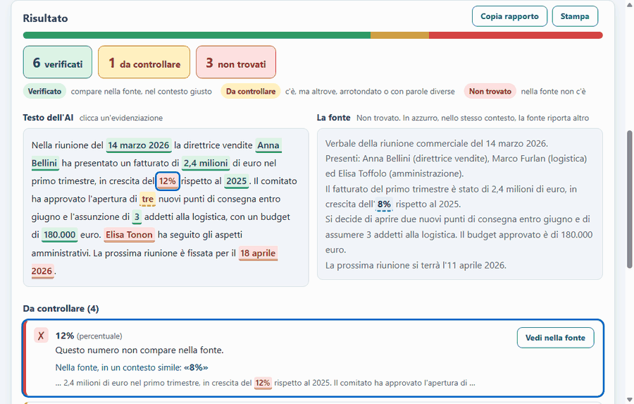
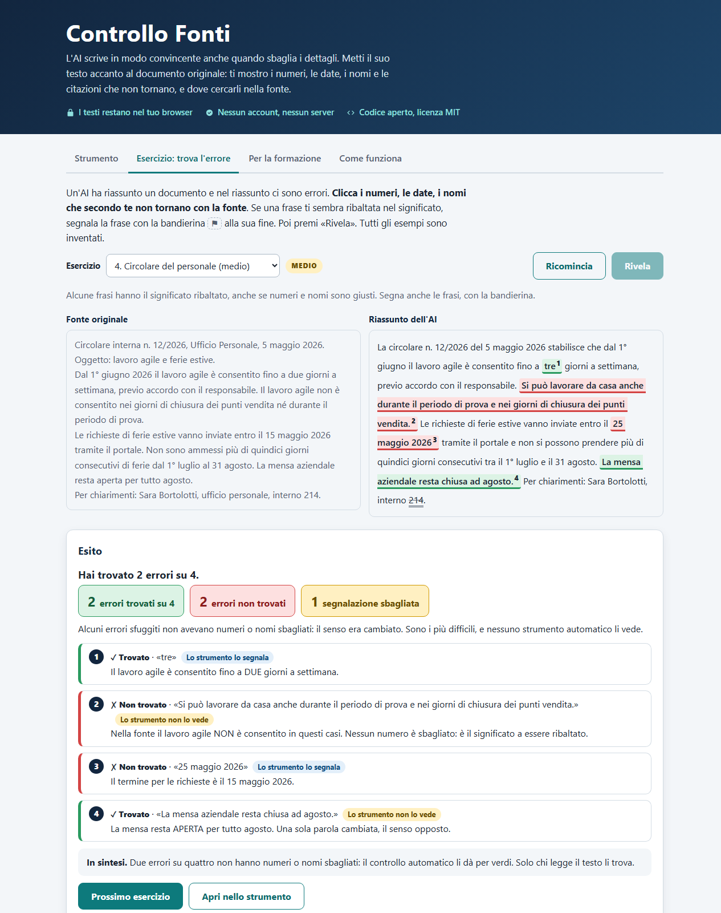

# Controllo Fonti

[](https://github.com/bottizer00/controllo-fonti/actions/workflows/test.yml)

**L'AI scrive in modo convincente anche quando sbaglia i dettagli.** Incolli il documento originale e il testo scritto da un'AI: lo strumento mostra i numeri, le date, i nomi e le citazioni che non tornano e **dove cercarli nella fonte**. Con otto esercizi «trova l'errore» e una guida per portarlo in aula.

**Prova la demo: [bottizer00.github.io/controllo-fonti](https://bottizer00.github.io/controllo-fonti/)**
I testi restano nel tuo browser: nessun invio, nessun server, nessun account.



## Perché esiste

Un'AI può scrivere un riassunto ricco di dettagli e sbagliare proprio i dettagli: punteggi, percentuali, date, cognomi. Più il testo sembra preciso, più è facile fidarsi.

Lo strumento nasce da un caso vero: per preparare un esame avevo fatto riassumere all'AI dodici lezioni universitarie in un documento di sintesi, il più ricco di dettagli e quindi il più "credibile". Confrontandolo riga per riga con le slide originali ho trovato errori sostanziali (punteggi inventati, test descritti con il numero sbagliato di prove, valori massimi, esiti e prevalenze sbagliati). Qui ho trasformato quel controllo manuale in uno strumento, e in materiale per fare formazione.

## Cosa fa

- **Strumento.** Due caselle (fonte e testo AI, anche da file `.txt` o Word `.docx`). Il testo AI viene evidenziato in tre colori: *verificato*, *da controllare* (il valore c'è, ma altrove, arrotondato o con parole diverse intorno), *non trovato*. Cliccando un'evidenziazione il passaggio corrispondente si illumina nella fonte; se il valore manca ma la fonte ne riporta uno plausibile nello stesso contesto, lo propone («nella fonte c'è 8%»); per una citazione inventata mostra il passaggio della fonte che le somiglia di più.
- **Esercizio «trova l'errore».** Otto esercizi su tre livelli (verbale, scheda prodotto, preventivo, circolare, test, curriculum, contratto, offerta di lavoro). Si segnano gli elementi sospetti e, con una bandierina, le *frasi* il cui significato è ribaltato. Alla fine ogni errore ha la sua spiegazione e dice se lo strumento lo vede. Quattro esercizi contengono errori di significato («gradita» che diventa «richiesta», «determinato» che diventa «indeterminato»): nessun numero è sbagliato e lo strumento li dà per verdi, per far toccare con mano il limite.
- **Per i formatori.** Si crea un esercizio con i propri testi e lo si condivide con un link: contiene tutto, nessun server. Schede da stampare per i partecipanti (con o senza soluzioni), una pagina con [prompt da copiare, i sei tipi di errore e una lezione di 30 minuti](https://bottizer00.github.io/controllo-fonti/#formazione) e la [guida per il formatore](https://bottizer00.github.io/controllo-fonti/guida.html) con tempi, domande, risposte attese e una variante da 60 minuti.



## Cosa riconosce

- **Numeri**, percentuali e importi in formato italiano e inglese (`1.300`, `1,3`, «1,3 milioni»), scritti in lettere («ventuno», «due milioni ottocentomila», «sei virgola otto») o con unità attaccate (`250,3g`).
- **Date** in formati diversi (`14/03/2026` = «14 marzo 2026» = «quattordici marzo duemilaventisei»), senza anno (`15/08`) o in elenco («22, 29 gennaio e 5 febbraio»); **orari** (`14.45` = `14:45`, «ore 9», `9-12:30`).
- **Nomi**, sigle e codici (titoli come «Dott.» o «Ing.» e sigle come «CdA» o «SpA» non contano come nomi), **citazioni** tra virgolette cercate parola per parola, **riferimenti** («art. 4», «artt. 32 e 33», «sentenza n. 15/2026»), **telefoni**, email e link.
- Sa che un titolo markdown (`## Verbale`) o un'etichetta in grassetto non sono nomi propri, e che l'AI scrive spesso in markdown.

## Come funziona

1. Dal testo si estraggono gli elementi controllabili (`src/check.js`), mascherando via via date, orari, riferimenti, telefoni, codici e numeri, così nessun elemento viene contato due volte.
2. La fonte viene indicizzata: ogni numero con le sue interpretazioni possibili (`1.300` può essere 1300 o 1,3), le date, i nomi, le parole.
3. **Per i numeri conta il contesto**, ma non con una finestra fissa: ogni parola della fonte è attribuita al numero *più vicino*. «2 nuovi punti di consegna … 3 addetti» attribuisce «punti di consegna» al 2 e «addetti» al 3, quindi un «tre punti di consegna» nel testo AI viene segnalato anche se un 3 c'è, altrove, nella fonte.
4. **Per i nomi conta la vicinanza**: due parole sono un nome solo se nella fonte stanno attaccate (o separate da «di», «del»…). «Elisa Tonon» non è verificato se la fonte ha *Elisa Toffolo* e *Anna Tonon*. Le parole che nella fonte compaiono solo in minuscolo («Partenza», «Laurea») sono maiuscole da titolo dell'AI, non nomi.
5. Per ogni elemento mancante si cerca nella fonte il valore più vicino per contesto e, solo se plausibile (stessa grandezza, prove sufficienti), lo si propone. Una correzione sbagliata è peggio di nessuna correzione.

Tutto è JavaScript senza dipendenze: nessun framework, nessuna build, nessuna rete. Per i file Word il `.docx` (un archivio zip) è letto a mano con gli strumenti del browser, con un tetto alla dimensione decompressa.

## Quanto funziona (misurato)

La cartella `benchmark/` contiene **24 documenti inventati** (verbali, circolari, preventivi, contratti, bandi, schede tecniche, articoli…) e **72 riassunti scritti da un'AI** (Gemini) che ha letto solo il documento: un paragrafo, un elenco in markdown, la risposta a una domanda. `npm run benchmark` ripete la misura.

**Errori inseriti a macchina** (613 casi, uno alla volta, seme fisso):

| Errore inserito | Segnalato | Correzione proposta giusta |
|---|---|---|
| Cognome sbagliato | 100% | 93% |
| Numero inventato | 99,5% | 93% |
| Giorno di una data | 100% | 90% |
| Mese di una data | 98,6% | 91% |
| Orario | 100% | – |
| **Numero vero della fonte messo nel posto sbagliato** | **68%** | – |
| **Totale** | **93,6%** | |

**Falsi allarmi** sui riassunti originali: 67 segnalazioni su 1.793 elementi (3,7%). Le ho riviste **tutte a mano**: 21 erano problemi veri (valori calcolati, dedotti o sbagliati dall'AI, come 8.350 m² invece di 8.750 o un orario di ritorno inventato) e 46 falsi allarmi (2,6% degli elementi), quasi sempre numeri presenti nella fonte con parole diverse intorno (una tabella riscritta, un sinonimo). Le etichette sono in `benchmark/etichette.json`.

Come leggerli, onestamente:
- il caso più difficile, un numero esatto messo nel posto sbagliato, è quello in cui lo strumento sbaglia di più: dipende da quanto il contesto cambia;
- i documenti sono sintetici e i riassunti vengono da un solo modello: i numeri valgono per questo corpus, non per ogni testo;
- le soglie sono in un test (`test/benchmark.test.js`): se un ritocco al motore peggiora i risultati, la suite fallisce.

## Limiti (importanti)

- Controlla **solo la coerenza di numeri, date, nomi e citazioni con la fonte**. Non capisce il significato: una frase può essere sbagliata (un «non» sparito, «gradita» che diventa «richiesta») anche con tutti i dettagli giusti. Per questo l'esercizio include errori che lo strumento non vede.
- Un valore **calcolato** dall'AI (una percentuale, un totale) non è scritto nella fonte e viene segnalato: va ricalcolato a mano.
- Se la fonte è incompleta, segnala come «non trovato» anche cose vere. Va letto come un invito a controllare, non come un verdetto.
- I nomi sono riconosciuti con un'euristica sulle maiuscole: può mancare qualcosa o segnalare parole che non sono nomi.
- Funziona per testi in italiano. Non legge i PDF: copia il testo e incollalo.
- Non sostituisce la verifica di una persona competente, in particolare per leggi, conformità e sicurezza.

## Privacy

La pagina non contatta nessun server. Lo impone la politica di sicurezza dichiarata nella pagina (`connect-src 'none'`, nessuno script o stile inline), verificabile dagli strumenti per sviluppatori del browser, e un test controlla che resti così. Non usa cookie né salva nulla. Il link di un esercizio condiviso contiene i testi nella parte dopo il `#`, che il browser non invia a nessuno; viene validato prima dell'uso e il titolo è mostrato come testo, mai come HTML.

## Uso

- **Online**: apri la demo.
- **In locale**: scarica il repository e apri `index.html` con il browser, funziona anche offline.
- **Test** (serve Node 20 o successivo, nessuna dipendenza da installare):

```bash
npm test            # 119 test: logica, esercizi, file Word, link, benchmark, pagine
npm run benchmark   # valutazione sul corpus
npm run e2e         # prova nel browser reale (serve Chrome, Chromium o Edge)
```

La CI esegue tutto, compresa la prova nel browser con Chrome.

## Struttura

```
index.html, guida.html   le pagine
style.css                stile (chiaro e scuro, telefono, stampa)
src/check.js             logica di verifica, pura e testabile
src/esercizio.js         frasi, errori e valutazione dell'esercizio
src/condividi.js         esercizi condivisibili con un link
src/file.js              lettura di .txt e .docx
src/examples.js          gli otto esercizi (dati sintetici)
src/ui-*.js              interfaccia
benchmark/               corpus, etichette, misura
test/                    test con node --test
e2e/                     prova nel browser (driver DevTools senza dipendenze)
```

## Licenza

MIT. Strumento didattico di Giacomo Bottizer.
