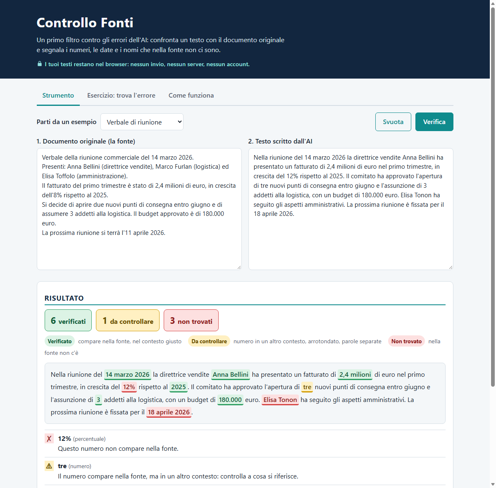

# Controllo Fonti

[](https://github.com/bottizer00/controllo-fonti/actions/workflows/test.yml)

**Un primo filtro contro gli errori dell'AI.** Incolli il documento originale e il testo scritto da un'AI: lo strumento evidenzia i numeri, le date e i nomi del testo che nella fonte non ci sono.

**Prova la demo: [bottizer00.github.io/controllo-fonti](https://bottizer00.github.io/controllo-fonti/)**
I testi restano nel tuo browser: nessun invio, nessun server, nessun account.



## Perché esiste

Un'AI può scrivere un riassunto ricco di dettagli e sbagliare proprio i dettagli: punteggi, percentuali, date, cognomi. Più il testo sembra preciso, più è facile fidarsi.

Lo strumento nasce da un caso vero: per preparare un esame avevo fatto riassumere all'AI dodici lezioni universitarie in un documento di sintesi, il più ricco di dettagli e quindi il più "credibile". Confrontandolo riga per riga con le slide originali ho trovato errori sostanziali (punteggi inventati, test descritti con il numero sbagliato di prove, valori massimi, esiti e prevalenze sbagliati). Qui ho trasformato quel controllo manuale in uno strumento, e in un esercizio da usare in formazione.

## Cosa fa

- **Strumento**: due caselle (fonte e testo AI). Il testo AI viene evidenziato in tre colori:
  - verde, *verificato*: l'elemento compare nella fonte, nel contesto giusto;
  - giallo, *da controllare*: il numero c'è ma in un altro contesto, è arrotondato, o le parole del nome ci sono ma non insieme;
  - rosso, *non trovato*: nella fonte non c'è.
  Sotto, l'elenco di ciò che non torna e un rapporto da copiare.
- **Esercizio «trova l'errore»**: tre riassunti inventati con errori nascosti. Si cliccano gli elementi sospetti, poi «Rivela» mostra il punteggio e cosa c'era da trovare. Utile in aula.
- **Cosa riconosce**: numeri e percentuali in formato italiano (`1.300`, `1,3`, «1,3 milioni», «tre»), importi, date in formati diversi (`14/03/2026` = «14 marzo 2026»), riferimenti («art. 4», «sentenza n. 15/2026»), nomi propri, sigle, codici, email e link.

## Come funziona

1. Dal testo si estraggono gli elementi controllabili (`src/check.js`), mascherando via via date, riferimenti, contatti e codici, così nessun elemento viene contato due volte.
2. La fonte viene indicizzata: ogni numero con le sue interpretazioni possibili (`1.300` può essere 1300 o 1,3), le date normalizzate, i nomi.
3. Per i numeri conta anche il **contesto**: si confrontano le due parole di contenuto prima e dopo il numero. Così «4 prove» non viene dato per buono solo perché un «4» compare altrove nella fonte, e «due nuovi punti» non si confonde con «3 addetti».
4. Un arrotondamento (1,3 milioni contro 1.280.000) è segnalato in giallo, non verde.

Tutto è JavaScript senza dipendenze: nessun framework, nessuna build, nessuna rete.

## Limiti (importanti)

- Controlla **solo la coerenza di numeri, date e nomi con la fonte**. Non capisce il significato: una frase può essere sbagliata anche con tutti i numeri giusti.
- Se la fonte è incompleta, segnala come «non trovato» anche cose vere. Va letto come un invito a controllare, non come un verdetto.
- I nomi sono riconosciuti con un'euristica sulle maiuscole: può mancare qualcosa o segnalare parole che non sono nomi.
- Funziona per testi in italiano; altre lingue sono coperte solo in parte (numeri e date sì, parole-numero e mesi no).
- Non sostituisce la verifica di una persona competente, in particolare per leggi, conformità e sicurezza.

## Privacy

La pagina non contatta nessun server. Lo impone la politica di sicurezza dichiarata nella pagina (`connect-src 'none'`), verificabile dagli strumenti per sviluppatori del browser. Non usa cookie né salva nulla.

## Uso

- **Online**: apri la demo.
- **In locale**: scarica il repository e apri `index.html` con il browser, funziona anche offline.
- **Test**: serve Node 20 o successivo, nessuna dipendenza da installare.

```bash
node --test
```

I test (36) coprono i formati numerici italiani e inglesi, scale e arrotondamenti, date in formati diversi, nomi, riferimenti, email e link, input vuoti o strani, testi molto lunghi (circa 300.000 caratteri in totale, in meno di 2 secondi sul mio computer) e gli esempi dell'esercizio, che devono restare coerenti con la logica.

## Struttura

```
index.html          pagina unica
style.css           stile (chiaro e scuro)
src/check.js        logica di verifica, pura e testabile
src/examples.js     esempi sintetici dell'esercizio
src/ui.js           interfaccia
test/               test con node --test
```

## Licenza

MIT. Strumento didattico di Giacomo Bottizer.
